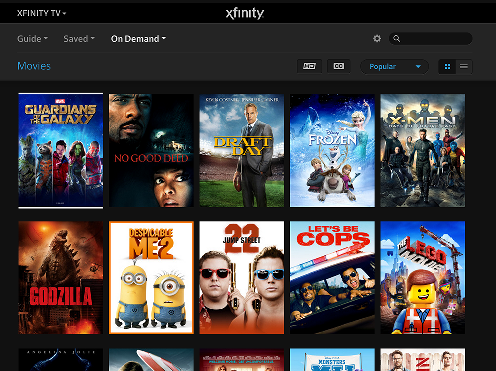
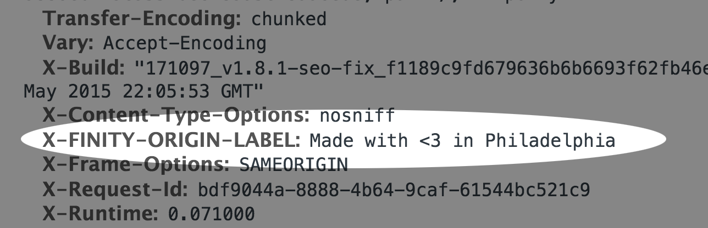
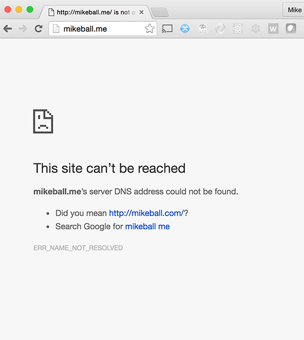
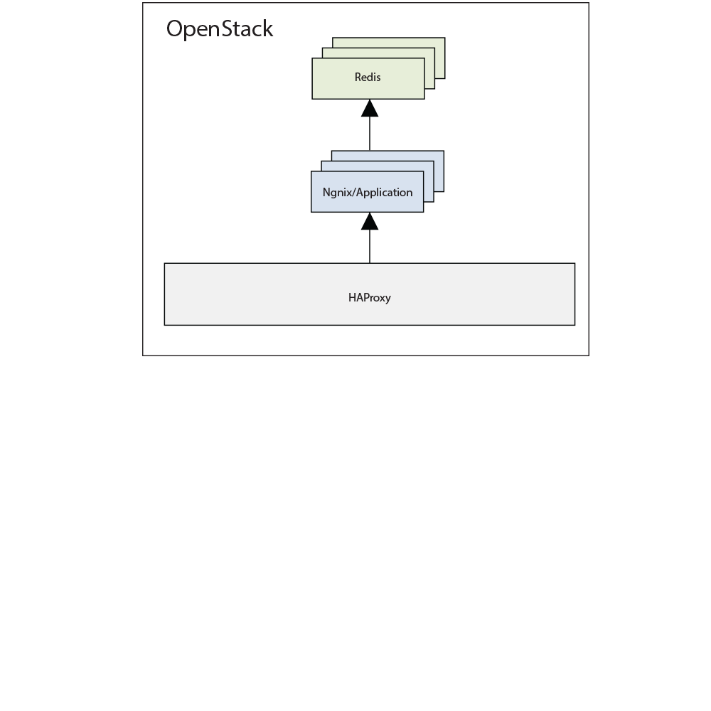
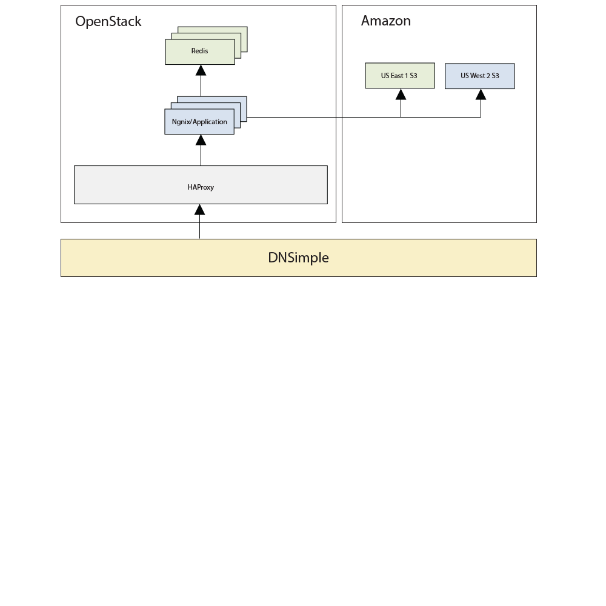

title: Terraform
theme: sjaakvandenberg/cleaver-light
author:
  name: Mike Ball
  url: https://github.com/mdb
output: index.html
style: style.css

---

# [Terraform](https://terraform.io)

## [Mike Ball](https://github.com/mdb)

---

### Mike Ball

* [mikeball.info](http://mikeball.info)
* [github.com/mdb](https://github.com/mdb)
* [twitter.com/clapexcitement](https://twitter.com/clapexcitement)

---

### Follow along

Slides are here:

[mdb.github.io/terraform-presentation](https://mdb.github.io/terraform-presentation)

---


---



---

# Relevancy to Senior Dev Day?

---



---

### Enter Terraform

A helpful tool towards this goal.

---

### What is Terraform?

> Terraform provides a common configuration to launch infrastructure &mdash; from physical and virtual servers to email and DNS providers.

Says [terraform.io](https://www.terraform.io/)

(oh, and [HashiCorp](https://www.hashicorp.com/) built it)

---

### Huh?

What does this definition mean?

* build, change, version infrastructure through common config file
* codify everything from physical hardware, VMs, and containers, to email and DNS providers
* with multi-cloud/provider support!

---

### How's that work?

* `.tf` config file allows teams to describe their infrastructure in simple DSL
* `terraform` CLI creates, changes, and destroys these resources accordingly

---

### What's that look like?

Declare `.tf` file resources via HCL (HashiCorp Configuration Lanaguage):

```
resource "digitalocean_droplet" "web" {
  name = "tf-web"
  size = "512mb"
  image = "centos-5-8-x32"
  region = "sfo1"
}

resource "dnsimple_record" "hello" {
  domain = "example.com"
  name = "test"
  value = "${digitalocean_droplet.web.ipv4_address}"
  type = "A"
}
```

---

### Basic CLI usage

* `terraform plan` to view the execution plan
* `terraform apply` to execute the plan
* `terraform destroy` to destroy infrastructure

(there are more; these are the basics)

---

### tfstate

Terraform saves record of infrastructure state in JSON.

* current state lives in `terraform.tfstate`
* backup of previous state lives in `terraform.tfstate.backup`

---

### CRUD lifecycle

`plan` + `apply` resolve what is _requested_ with what _exists_, using `.tf`, provider APIs, and `tfstate`.

---

### But how to safely orchestrate such changes?

* how to coordinate across a team? Across a company?
* how to guarantee safety?
* how to run infrastructure changes through CI?

---

### Thesis statement

terraform
+
software engineering practices (git, code review, CI)
=
😎

---

### Example

[github.com/mdb/terraform-example](https://github.com/mdb/terraform-example)

* demos continuous delivery with Terraform from [TravisCI](http://travis-ci.org)
* A pull request turned `mikeball.me` from 1) source code into 2) a functional website

---

# Before TravisCI build...

---



---

### After TravisCI build/deploy

[mikeball.me](http://mikeball.me)

---

### How'd this happen?

1. merge "genesis" [PR #2](https://github.com/mdb/terraform-example/pull/2)
2. TravisCI creates builds/deploys: [travis-ci.org/mdb/terraform-example](https://travis-ci.org/mdb/terraform-example/builds/127358870)

---

### TravisCI details please

Let's tour the [`.travis.yml`](https://github.com/mdb/terraform-example/blob/master/.travis.yml)

---

# And let's tour [`deploy.sh`](https://github.com/mdb/terraform-example/blob/master/deploy.sh)

---

# And let's tour [`terraform/main.tf`](https://github.com/mdb/terraform-example/blob/master/terraform/main.tf)

---

### What about making a change?

Demo time!

---

### PR #3

[mdb/terraform-example/pull/3](https://github.com/mdb/terraform-example/pull/3)

Slight HTML edit to source a CSS file

(maybe not the most infrastructure-intensive change but hopefully you see my point)

---

# [mikeball.me](http://mikeball.me)

---

# Why?

---

# Quality

---

Codified infrastructure managed like software source code via code reviews!

* quality at scale
* change is cheap & repeatable (safe + easy)
* declarative DSL is preferable to custom business logic
* state backups

---

### More advanced usage

`mdb/terraform-example` is a simple example but...

* layer in more sophisticated delivery tool on top of CI
* layer in blue/green deployments and live functional tests
* create pipelines that promote code changes through lower level envs & into prod

---

# Some more about Terraform...

---

### Terraform VS other tools

---

### Tool category 1: gophercloud, Fog, etc.

API client libraries vs. syntax for describing cloud resources

---

```ruby
if server.nil?
  compute.servers.create(flavor_id: 1, image_id: 3, name: 'my_server')
else
  # do something else
end
```

---

```
resource "aws_instance" "my_server" {
  ami = "ami-408c7f28"
  instance_type = "t1.micro"
}
```

---

### Tool category 2: Chef, Puppet, etc.

Individual machine management vs. higher level datacenter/service abstraction

---

### Config management

Good at...

---


---


---

# Terraform is good at...

---


---


---

Provider-specific vs. multi-provider agnostic

---

### CloudFormation & Heat

Good at...

---



---

# Terraform is good at...

---



---

### Multi-provider support

[github.com/hashicorp/terraform/tree/master/builtin/providers](https://github.com/hashicorp/terraform/tree/master/builtin/providers)

---

# Some other points of note...

---

### Remote state

How to coordinate across teams? And avoid merge conflicts?

And keep sensitive data secret?

Enter [remote state](https://www.terraform.io/docs/state/remote/index.html)

---

### Supported backends

* artifactory
* atlas
* consul
* etcd
* http
* s3
* swift

---

# Custom providers

---


---

> If it's an internet-accessible API that can be modeled declaratively, it can be terraform'd.

says Paul Hinze, Terraform core contributor

---

### Custom providers

What is a provider?

> A provider in Terraform is responsible for the lifecycle of a resource: create, read, update, delete

says terraform.io

(i.e. AWS, Heroku, `your-internal-service`)

---

### Write your own

Big benefits!

* Terraform internal services
* abstract away per-team business logic to a shared `terraform-provider-${foo}`
* ensure against provider lock-in; `tf` changes are cheap

[Read more &raquo;](https://www.terraform.io/docs/plugins/provider.html)

---

### Finally: some gotchas

* sensitive data in `tfstate`
* edits outside of terraform get wacky
* "destructive" actions can will yield downtime
* confession: I manually edited domain DNS servers to match A record name servers

---

### Shameful plug: my team is hiring

* Java, Scala, Python, Ruby, JavaScript, Golang
* distributed systems, TV and video streaming
* Ansible, Packer, Terraform, Consul
* Docker, CentOS, Ubuntu
* OpenStack, CloudFoundry, AWS

---

# Questions?

---
